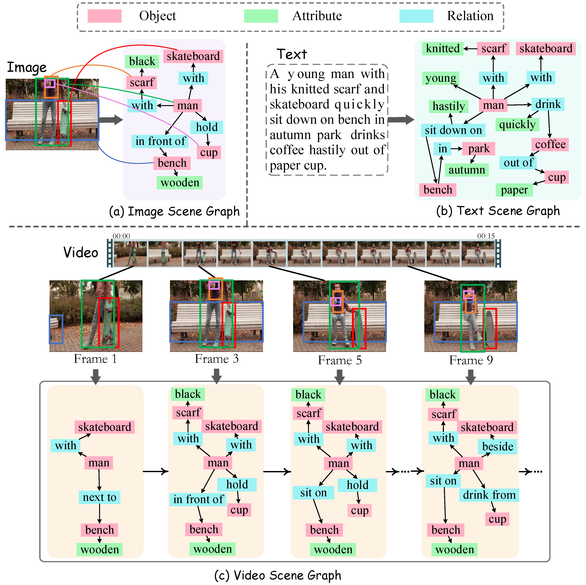

<h1> Awesome-Scene-Graph-for-Cross-Modal-Learning </h1> 

# 🎨 Introduction 
A scene graph is a topological structure representing a scene described in text, image, video, or etc. 
In this graph, the nodes correspond to object bounding boxes with their category labels and attributes, while the edges represent the pair-wise relationships between objects. 
  

  

---

# 📕 Table of Contents
- [🎨 Introduction](#-introduction)
- [📕 Table of Contents](#-contents)
- [🌷 Scene Graph Datasets](#-datasets)
- [🍕 Scene Graph Generation](#-scene-graph-generation)
  - [2D (Image) Scene Graph Generation](#2d-image-scene-graph-generation)
  - [Spatio-Temporal (Video) Scene Graph Generation](#spatio-temporal-video-scene-graph-generation)
  - [Audio Scene Graph Generation](#audio-scene-graph-generation)
  - [3D Scene Graph Generation](#3d-scene-graph-generation)
  - [Textual Scene Graph Generation](#textual-scene-graph-generation)
- [🥝 Scene Graph Application](#-scene-graph-application)
  - [Image Retrieval](#image-retrieval)
  - [2D Image Generation](#2d-image-generation)
  - [3D Generation](#3d-generation)
  - [Visual Question Answering](#visual-question-answering)
  - [Mitigate Hallucination](#mitigate-hallucination)
  - [Dynamic Environment Guidance](#dynamic-environment-guidance)
  - [Privacy-sensitive Object Identification](#privacy-sensitive-object-identification)
  - [Image Captioning](#)
  - [Video Retrieval](#video-retrieval)
- [Evaluation Metrics](#evaluation-metrics)
- [⭐️ Star History](#️-star-history)

---

# 🌷 Scene Graph Datasets

| Dataset |  Modality  |   Obj. Class  | BBox | Rela. Class | Triplets | Instances | 
|:--------:|:--------:|:--------:| :--------:|  :--------:|  :--------:|  :--------:|
| [Visual Phrase](https://vision.cs.uiuc.edu/phrasal/) | Image | 8 | 3,271 | 9 | 1,796 | 2,769 |
| [Scene Graph](https://openaccess.thecvf.com/content_cvpr_2015/papers/Johnson_Image_Retrieval_Using_2015_CVPR_paper.pdf) | Image | 266 | 69,009 | 68 | 109,535 | 5,000 |
| [VRD](https://cs.stanford.edu/people/ranjaykrishna/vrd/)  | Image | 100 | - | 70 | 37,993 | 5,000 |
| [Open Images v7](https://storage.googleapis.com/openimages/web/index.html)  | Image | 57 | 3,290,070 | 329 | 374,768 | 9,178,275 |
| [Visual Genome](https://homes.cs.washington.edu/~ranjay/visualgenome/index.html) | Image | 33,877 | 3,843,636 | 40,480 | 2,347,187 | 108,077 | 
| [VrR-VG](http://vrrvg.com/) | Image | 1,600 | 282,460 | 117 | 203,375 | 58,983 |
| [UnRel](https://www.di.ens.fr/willow/research/unrel/) | Image | - | - | 18 | 76 |  1,071 |
| [SpatialSense](https://github.com/princeton-vl/SpatialSense) | Image | 3,679 | - | 9 | 13,229 | 11,569 |
| [SpatialVOC2K](https://github.com/muskata/SpatialVOC2K) | Image | 20 | 5,775 | 34 | 9,804 | 2,026 | 
| [OpenSG](https://github.com/Jingkang50/OpenPSG) | Image (panoptic) | 133 | - | 56 | - | 49K |
| [AUG](https://arxiv.org/pdf/2404.07788) | Image (Overhead View) | 76 | - | 61 | - | - |
| [STAR](https://arxiv.org/pdf/2406.09410) | Satellite Imagery | 48 | 219,120 | 58 | 400,795 | 31,096 |
| [ReCon1M](https://arxiv.org/pdf/2406.06028) | Satellite Imagery | 60 |  859,751 | 64 | 1,149,342 |  21,392 |
| [SkySenseGPT](https://github.com/Luo-Z13/SkySenseGPT) | Satellite Imagery (Instruction) | - | - | - | - | - |
| [ImageNet-VidVRD](https://xdshang.github.io/docs/imagenet-vidvrd.html) | Video | 35 | - | 132 | 3,219 | 100 |
| [VidOR](https://xdshang.github.io/docs/vidor.html) | Video | 80 | - | 50 | - | 10,000 |
| [Action Genome](https://github.com/JingweiJ/ActionGenome) | Video | 35 | 0.4M | 25 | 1.7M | 10,000 |
| [AeroEye](https://arxiv.org/pdf/2406.01029) | Video (Drone-View) | 56 | - | 384 | - | 2.2M |
| [PVSG](https://jingkang50.github.io/PVSG/) | Video (panoptic) | 126 | - |  57 |  - | 400|
| [3D Semantic Scene Graphs (3DSSG)](https://openaccess.thecvf.com/content_CVPR_2020/papers/Wald_Learning_3D_Semantic_Scene_Graphs_From_3D_Indoor_Reconstructions_CVPR_2020_paper.pdf) | 3D | 40 | - | - | - | 48K|
| [PSG4D](https://arxiv.org/pdf/2405.10305) | 46 | - | 15 | - | - | - |
| [FACTUAL](https://github.com/zhuang-li/FactualSceneGraph) | Text | - | - | - | - | 40,369 |

---

<!-- CVPR-8A2BE2 -->
<!-- WACV-6a5acd -->
<!-- NIPS-CD5C5C -->
<!-- ICML-FF7F50 -->
<!-- ICCV-00CED1 -->
<!-- ECCV-1e90ff -->
<!-- TPAMI-BC8F8F -->
<!-- IJCAI-228b22 -->
<!-- AAAI-c71585 -->
<!-- arXiv-b22222 -->

# 🍕 Scene Graph Generation

## 2D (Image) Scene Graph Generation

### LLM-based 

+ [**Scene Graph Generation Strategy with Co-occurrence Knowledge and Learnable Term Frequency**](https://arxiv.org/pdf/2405.12648)  

+ [**SkySenseGPT: A Fine-Grained Instruction Tuning Dataset and Model for Remote Sensing Vision-Language Understanding**](https://arxiv.org/pdf/2406.10100)   

+ [**From Pixels to Graphs: Open-Vocabulary Scene Graph Generation with Vision-Language Models**](https://arxiv.org/pdf/2404.00906)   

### Non-LLM-based

+ [**Leveraging Predicate and Triplet Learning for Scene Graph Generation**](https://arxiv.org/pdf/2406.02038)   
 

+ [**DSGG: Dense Relation Transformer for an End-to-end Scene Graph Generation**](https://arxiv.org/pdf/2403.14886)   

+ [**HiKER-SGG: Hierarchical Knowledge Enhanced Robust Scene Graph Generation**](https://arxiv.org/pdf/2403.12033)  

+ [**EGTR: Extracting Graph from Transformer for Scene Graph Generation**](https://arxiv.org/pdf/2404.02072)   

+ [**STAR: A First-Ever Dataset and A Large-Scale Benchmark for Scene Graph Generation in Large-Size Satellite Imagery**](https://arxiv.org/pdf/2406.09410)   

+ [**Improving Scene Graph Generation with Relation Words’ Debiasing in Vision-Language Models**](https://arxiv.org/pdf/2403.16184) 

+ [**ReCon1M:A Large-scale Benchmark Dataset for Relation Comprehension in Remote Sensing Imagery**](https://arxiv.org/pdf/2406.06028) 

+ [**Reltr: Relation transformer for scene graph generation**](https://arxiv.org/abs/2201.11460)   

+ [**SGTR: End-to-end Scene Graph Generation with Transformer**](https://arxiv.org/pdf/2112.12970)  

+ [**Iterative Scene Graph Generation**](https://proceedings.neurips.cc/paper_files/paper/2022/file/99831104028c3b7e6079fd8bdcc42c8f-Paper-Conference.pdf)  

+ [**GPS-Net: Graph Property Sensing Network for Scene Graph Generation**](https://arxiv.org/pdf/2003.12962)   

+ [**Graphical Contrastive Losses for Scene Graph Parsing**](https://openaccess.thecvf.com/content_CVPR_2019/papers/Zhang_Graphical_Contrastive_Losses_for_Scene_Graph_Parsing_CVPR_2019_paper.pdf)  

+ [**Learning to Compose Dynamic Tree Structures for Visual Contexts**](https://openaccess.thecvf.com/content_CVPR_2019/papers/Tang_Learning_to_Compose_Dynamic_Tree_Structures_for_Visual_Contexts_CVPR_2019_paper.pdf)   

+ [**Neural motifs: Scene graph parsing with global context**](https://openaccess.thecvf.com/content_cvpr_2018/papers/Zellers_Neural_Motifs_Scene_CVPR_2018_paper.pdf)   

+ [**Scene Graph Generation From Objects, Phrases and Region Captions**](https://openaccess.thecvf.com/content_ICCV_2017/papers/Li_Scene_Graph_Generation_ICCV_2017_paper.pdf)  

+ [**Visual Relationship Detection with Language Priors**](https://arxiv.org/pdf/1608.00187)  

## Spatio-Temporal (Video) Scene Graph Generation

VSG provides a detailed and structured interpretation of the whole scene by parsing an event into a sequence of interactions between different visual entities.

### LLM-based 

+ [**Tri-modal Confluence with Temporal Dynamics for Scene Graph Generation in Operating Rooms**](https://arxiv.org/pdf/2404.09231) 

### Non-LLM-based

+ [**CYCLO: Cyclic Graph Transformer Approach to Multi-Object Relationship Modeling in Aerial Videos**](https://arxiv.org/pdf/2406.01029) 

+ [**OED: Towards One-stage End-to-End Dynamic Scene Graph Generation**](https://arxiv.org/pdf/2405.16925)  

+ [**End-to-End Video Scene Graph Generation With Temporal Propagation Transformer**](https://ieeexplore.ieee.org/document/10145598) 

+ [**Unbiased scene graph generation in videos**]()  

+ [**Panoptic Video Scene Graph Generation**](https://openaccess.thecvf.com/content/CVPR2023/papers/Yang_Panoptic_Video_Scene_Graph_Generation_CVPR_2023_paper.pdf)  

+ [**Cross-Modality Time-Variant Relation Learning for Generating Dynamic Scene Graphs**](https://arxiv.org/abs/2305.08522)  

+ [**Video Scene Graph Generation from Single-Frame Weak Supervision**](https://openreview.net/pdf?id=KLrGlNoxzb4)  

+ [**Prior Knowledge-driven Dynamic Scene Graph Generation with Causal Inference**](https://dl.acm.org/doi/10.1145/3581783.3612249)  

+ [**Dynamic scene graph generation via temporal prior inference**](https://dl.acm.org/doi/abs/10.1145/3503161.3548324) 

+ [**VRDFormer: End-to-End Video Visual Relation Detection with Transformers**](https://openaccess.thecvf.com/content/CVPR2022/papers/Zheng_VRDFormer_End-to-End_Video_Visual_Relation_Detection_With_Transformers_CVPR_2022_paper.pdf)  

+ [**Dynamic Scene Graph Generation via Anticipatory Pre-training**](https://openaccess.thecvf.com/content/CVPR2022/papers/Li_Dynamic_Scene_Graph_Generation_via_Anticipatory_Pre-Training_CVPR_2022_paper.pdf) 

+ [**Meta Spatio-Temporal Debiasing for Video Scene Graph Generation**](https://www.ecva.net/papers/eccv_2022/papers_ECCV/papers/136870368.pdf) 

+ [**Spatial-temporal transformer for dynamic scene graph generation**](https://openaccess.thecvf.com/content/ICCV2021/papers/Cong_Spatial-Temporal_Transformer_for_Dynamic_Scene_Graph_Generation_ICCV_2021_paper.pdf)  

+ [**Target adaptive context aggregation for video scene graph generation**](https://openaccess.thecvf.com/content/ICCV2021/papers/Teng_Target_Adaptive_Context_Aggregation_for_Video_Scene_Graph_Generation_ICCV_2021_paper.pdf)  

+ [**Video Visual Relation Detection**](https://dl.acm.org/doi/10.1145/3123266.3123380)  

## Audio Scene Graph Generation

+ [**Visual Scene Graphs for Audio Source Separation**](https://openaccess.thecvf.com/content_cvpr_2015/papers/Johnson_Image_Retrieval_Using_2015_CVPR_paper.pdf)  

+ [**Learning Audio-Visual Dynamics Using Scene Graphs for Audio Source Separation**](https://arxiv.org/pdf/2210.16472)  

## 3D Scene Graph Generation

+ [**EchoScene: Indoor Scene Generation via Information Echo over Scene Graph Diffusion**](https://arxiv.org/pdf/2405.00915)   

+ [**Weakly-Supervised 3D Scene Graph Generation via Visual-Linguistic Assisted Pseudo-labeling**](https://arxiv.org/pdf/2404.02527)  

+ [**Incremental 3D Semantic Scene Graph Prediction from RGB Sequences**](https://openaccess.thecvf.com/content/CVPR2023/papers/Wu_Incremental_3D_Semantic_Scene_Graph_Prediction_From_RGB_Sequences_CVPR_2023_paper.pdf)  

+ [**SceneGraphFusion: Incremental 3D Scene Graph Prediction from RGB-D Sequences**](https://openaccess.thecvf.com/content/CVPR2021/papers/Wu_SceneGraphFusion_Incremental_3D_Scene_Graph_Prediction_From_RGB-D_Sequences_CVPR_2021_paper.pdf)   

+ [**Learning 3D Semantic Scene Graphs from 3D Indoor Reconstructions**](https://openaccess.thecvf.com/content_CVPR_2020/papers/Wald_Learning_3D_Semantic_Scene_Graphs_From_3D_Indoor_Reconstructions_CVPR_2020_paper.pdf)    

## Textual Scene Graph Generation

---

# 🥝 Scene Graph Application

## Image Retrieval

+ [**Cross-modal Scene Graph Matching for Relationship-aware Image-Text Retrieval**](https://openaccess.thecvf.com/content_WACV_2020/papers/Wang_Cross-modal_Scene_Graph_Matching_for_Relationship-aware_Image-Text_Retrieval_WACV_2020_paper.pdf) 

+ [**Image Retrieval using Scene Graphs**](https://openaccess.thecvf.com/content_cvpr_2015/papers/Johnson_Image_Retrieval_Using_2015_CVPR_paper.pdf) 

## 2D Image Generation

+ [**SG-Adapter: Enhancing Text-to-Image Generation with Scene Graph Guidance**](https://arxiv.org/pdf/2405.15321) 

+ [**Generated Contents Enrichment**](https://arxiv.org/pdf/2405.03650) 

## Visual Question Answering 
+ [**SOK-Bench: A Situated Video Reasoning Benchmark with Aligned Open-World Knowledge**](https://arxiv.org/pdf/2405.09713)  

## 3D Generation

+ [**Compositional 3D Scene Synthesis with Scene Graph Guided Layout-Shape Generation**](https://arxiv.org/pdf/2403.12848) 

## Mitigate Hallucination 

+ [**BACON: Supercharge Your VLM with Bag-of-Concept Graph to Mitigate Hallucinations**](https://arxiv.org/pdf/2407.03314)   

## Dynamic Environment Guidance

+ [**Situational Instructions Database: Task Guidance in Dynamic Environments**](https://arxiv.org/pdf/2406.13302)  

+ [**RoboHop: Segment-based Topological Map Representation for Open-World Visual Navigation**](https://arxiv.org/pdf/2405.05792)  

+ [**LLM-Personalize: Aligning LLM Planners with Human Preferences via Reinforced Self-Training for Housekeeping Robots**]()   

## Privacy-sensitive Object Identification
+ [**Beyond Visual Appearances: Privacy-sensitive Objects Identification via Hybrid Graph Reasoning**](https://arxiv.org/pdf/2406.12736) 

## Video Retrieval

+ [**A Review and Efficient Implementation of Scene Graph Generation Metricsl**](https://arxiv.org/pdf/2404.09616)   

---

# Evaluation Metrics

+ [**A Review and Efficient Implementation of Scene Graph Generation Metrics**](https://arxiv.org/pdf/2404.09616)   

+ [**Semantic Similarity Score for Measuring Visual Similarity at Semantic Level**](https://arxiv.org/pdf/2406.03865) 

# ⭐️ Star History

